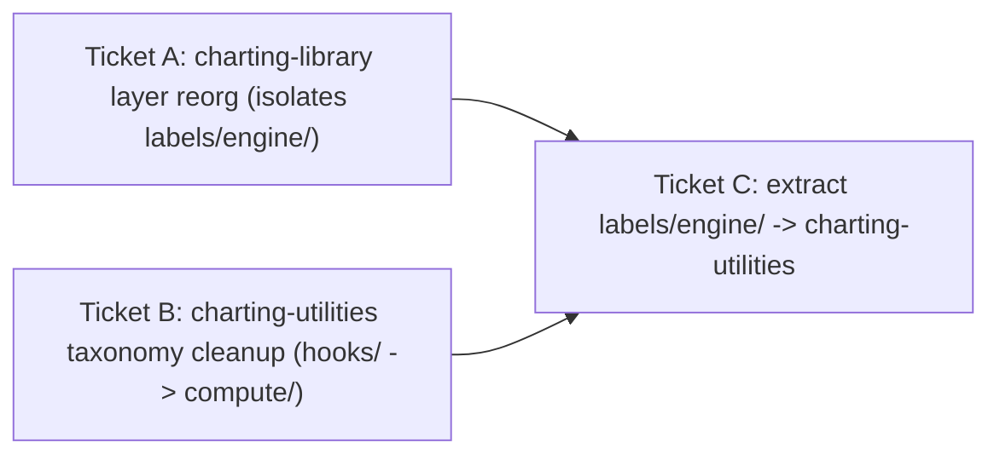

# Charting Utilities Reorg + Label-Engine Extraction

> **Status:** Tickets B and C complete. Label layout engine lives in `labelLayout/`.
> **Scope:** `@prc/charting-utilities` internal structure (Ticket B) + a cross-package move of the label engine out of `@prc/charting-library` (Ticket C).
> **Bumps:** Ticket B = `patch` (internal, public `index.ts` surface unchanged). Ticket C = `minor` on `@prc/charting-utilities` (new exports) + `patch` on `@prc/charting-library`.

## TL;DR

`@prc/charting-utilities` has the same "folder named by what it isn't" smell that the charting-library reorg fixes: its `hooks/` folder is almost entirely **non-hooks** (pure `get*` / `position*` prop + data builders), and the genuine React hooks are scattered across both `hooks/` and `utilities/`. This doc proposes:

- **Ticket B — taxonomy cleanup:** rename the misnamed `hooks/` to `compute/` (headless builders), create a real `hooks/` holding only React hooks (consolidated from `utilities/` + `hooks/`), and keep `utilities/` as pure framework-agnostic helpers/math/config.
- **Ticket C — label-engine extraction:** move the framework-agnostic label-layout engine out of `@prc/charting-library/src/lib/labels/engine/` (isolated there by the library reorg, Ticket A) into the now-clean `@prc/charting-utilities`.

These are intentionally **not** folded into the charting-library reorg: different package, different changeset, broader consumer blast radius.

---

## Why these are separate from the library reorg

The library reorg (Ticket A) is single-package, behavior-preserving, `patch`, no public API change. Touching `@prc/charting-utilities`:

- is a **different workspace** (`prc-scripts`) with **three consumers** — `prc-charting-library`, `prc-chart-builder`, `prc-custom-charts` — almost all importing via the package `index.ts`.
- Ticket C specifically **changes the public surface** (adds exports → `minor`) and repoints the 5 label/leader-line anchor tests across packages.

Ticket A leaves a clean seam (`labels/engine/`) precisely so Ticket C is a near-mechanical lift.

---

## Current state (audit)

### Smell 1 — `hooks/` is mostly non-hooks

`hooks/index.ts` imports `React` but `getSharedProps` is a plain prop-aggregator (no `useState`/`useEffect` — it just composes other `get*` builders); `hooks/axes.ts` pulls in `React` only for a `ReactElement` *type*. Every export is `get*` / `position*`:

| File | Exports | Hook? |
| --- | --- | --- |
| `hooks/aria.ts` | `getAria` | No |
| `hooks/axes.ts` | `getAxisProps` (+ date-format helpers) | No |
| `hooks/grid.ts` | `getGridProps` | No |
| `hooks/labels.ts` | `getLabelFormat`, `getLabelProps`, `positionBarLabel` | No |
| `hooks/legend.ts` | `getLegendProps` | No |
| `hooks/line.ts` | `getLineProps` | No |
| `hooks/size.ts` | `getChartDimensions` | No |
| `hooks/text.ts` | `getTextVisible` | No |
| `hooks/tooltips.ts` | `getLocalPoint`, `getTooltip*` | No |
| `hooks/voronoi.ts` | `getVoronoiProps` | No |
| `hooks/data.ts` | `getFlattenedData`, `getGroupedData`, `getGroupPositioning*` | No |
| `hooks/index.ts` | `getSharedProps` (+ re-exports) | No |
| `hooks/useWorldCountryData.ts` | `useWorldCountryData` | **Yes** |
| `hooks/useStateData.ts` | `useStateData`, `useStateGridData` (+ pure `findStateDataRow`, `fipsToStateAbbr`) | **Mixed** |

### Smell 2 — real React hooks scattered across `utilities/`

Genuine hooks also live in `utilities/`: `useSize`, `useDarkMode`, `useLocalStorage`, `useMedia`, `useRegressionLine` (+ `useRegressionLines`). So "where are the hooks?" has no single answer today.

### Safety: public surface is the flat `index.ts`

Consumers import `from '@prc/charting-utilities'` (the package `index.ts` named exports). Internal folder moves are invisible to them as long as `index.ts` keeps the same export names — same forwarding-seam principle as the library reorg. Externalized as `prcChartingUtilities` (`dependency-extraction.js:46`).

**Deep-import hotspots (bypass `index.ts` — must be repointed if their target file moves):**

- `prc-chart-builder/tests/unit/resolve-category-color.test.js` → `utilities/resolveCategoryColor`
- `prc-charting-library/src/lib/maps/world/create-optimized-regional-topologies.js` → `utilities/mapRegionPresets.ts` (this path also shifts under the library reorg's `lib/maps/` → `data/maps/` rename — coordinate)
- Docs only (no breakage, repoint opportunistically): `prc-chart-builder/docs/*` reference `hooks/tooltips.ts`, `utilities/resolveCategoryColor.ts`, etc.

Both real deep-imports target `utilities/`, which Ticket B largely leaves in place — so the cleanup's blast radius is small.

---

## Ticket B — target taxonomy

```
@prc/charting-utilities/
├── types/          # unchanged (already clean)
├── compute/        # was hooks/ — headless prop + data builders (get*Props, getSharedProps,
│                   #   getFlattenedData, getGroupedData, group-positioning, voronoi, tooltip format)
├── hooks/          # ONLY real React hooks, consolidated:
│                   #   useSize, useDarkMode, useLocalStorage, useMedia, useRegressionLine(s)
│                   #   (from utilities/) + useWorldCountryData, useStateData (already here)
├── utilities/      # pure framework-agnostic helpers/math/config:
│                   #   baseConfig, randomData, helpers, resolveCategoryColor, regression,
│                   #   colorPalettes, loadTopology, mapRegionPresets, DataContext, dataMapFunction
├── data/           # static json (abbreviations, iso-alpha3) — unchanged
└── index.ts        # public surface — export names UNCHANGED
```

Notes:
- **`compute/` name** is the recommendation; `builders/` is an acceptable alternative. Pick one and apply consistently.
- **`useStateData.ts` is mixed** (hooks + pure `findStateDataRow`/`fipsToStateAbbr`). Either move the file wholesale into `hooks/` (simplest) or split the pure helpers into `utilities/`. Recommend wholesale move first; split only if a non-hook consumer appears.
- **`index.ts` is the seam.** Keep all current export names; only the internal `./hooks/...` / `./utilities/...` source paths change.

### Ticket B migration (each step green)

1. `git mv hooks/ compute/`; update `compute/index.ts` internal paths + `index.ts` re-export paths. `tsc` + build.
2. Create `hooks/`; `git mv` the real hooks out of `utilities/` (+ keep `useWorldCountryData`/`useStateData`); update `index.ts` re-export paths. `tsc` + build.
3. Repoint the deep-import hotspots if any moved (the two `utilities/` deep imports are unaffected by B).
4. `patch` changeset: "internal: charting-utilities taxonomy cleanup (hooks/ → compute/; consolidate real hooks)."

---

## Ticket C — label-engine extraction

Depends on Ticket A (library reorg isolates `labels/engine/`) and is cleanest after Ticket B.

**Moves out of `@prc/charting-library/src/lib/labels/engine/` into `@prc/charting-utilities`:**

| Library file | Lands in charting-utilities |
| --- | --- |
| `computeLabelDeclutter.ts`, `forceRectCollide.ts`, `measureLabel.ts`, `leaderLineGeometry.ts`, `leaderLineStore.ts`, `helpers.ts` | a cohesive `labelLayout/` module (keep the subsystem together; it stays unit-testable as one unit) |
| `buildLineChartLabels.ts`, `buildOnLineSeriesLabels.ts`, `buildScatterLabels.ts` | `compute/` (they are prop/data builders) **or** the same `labelLayout/` module for cohesion |
| `types.ts` | merge into `types/labels.ts` (already exists) |

**Stays in `@prc/charting-library/src/lib/labels/`** (React/SVG, decided in Ticket A): `DraggableLabel`, `NetValueLabels`, `OnLineSeriesLabel`, `DirectSeriesLegendLabels`, `LeaderLine`, `LeaderLineUnderlay`, `LabelLeaderLineRegistrar`, `LeaderLineContext`, and the stateful hooks `useLabelDeclutter` / `useDirectSeriesLegend` / `useLeaderLineRegistration`. These consume the extracted engine via `from '@prc/charting-utilities'`.

> **Boundary decision:** extract only the framework-agnostic engine. The stateful hooks wrap the engine but are coupled to the leader-line React context (plugin-only), so they stay. Revisit moving `useLabelDeclutter` later only if a non-plugin consumer appears.

### Ticket C migration

1. Land the engine files in `@prc/charting-utilities` (`labelLayout/` + merge types), add to `index.ts`. `tsc` + build the utilities package.
2. In `@prc/charting-library`, delete the moved files from `labels/engine/`; repoint the label components/hooks to `from '@prc/charting-utilities'`.
3. Repoint the **5 anchor tests** (`prc-chart-builder/tests/unit/{label-declutter,scatter-dotplot-declutter,on-line-series-labels,leader-line-store,leader-line-geometry}.test.js`) from the old `charting-library` paths to `@prc/charting-utilities`.
4. Changesets: `minor` on `@prc/charting-utilities` (new exports), `patch` on `@prc/charting-library`.

### Verification (both tickets)

- `npx tsc --noEmit` in each touched package; `npx eslint <changed>` clean.
- `npx turbo build --filter=@prc/charting-utilities... --filter=@prc/charting-library... --filter=@prc/chart-builder --filter=@prc/custom-charts` green (custom-charts is the third consumer — don't forget it).
- All 5 label/leader-line unit tests pass after Ticket C's repoint.
- Manual smoke: line / bar / scatter / pie / map render; labels + leader lines intact (Ticket C exercises the moved engine at runtime).

---

## Sequencing



A and B are independent and can land in either order; C depends on both (it needs A's clean `labels/engine/` seam and lands into B's clean structure).
